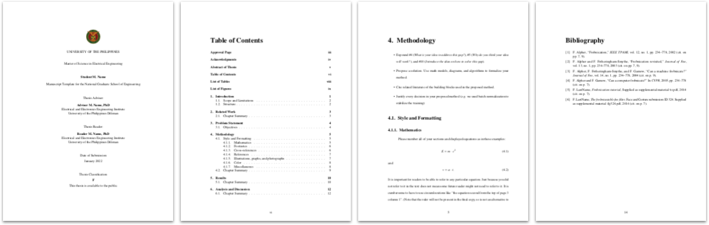

## Overview
- Thesis manuscript template for the National Graduate School of Engineering (NGSE), UP Diliman.
- Based on the [`scrbook`](https://ctan.org/pkg/scrbook) document class. Follows the general styling of the [NGSE manuscript template](https://coe.upd.edu.ph/forms/).
- Form and structure follows the guide created by [Dr. Rowel Atienza](https://github.com/roatienza). The outlines for each chapter were directly lifted from his guide.
- See precompiled samples for the [proposal](https://github.com/baudm/ngse-manuscript/blob/main/samples/proposal.pdf) (APA-style bib) and [review version](https://github.com/baudm/ngse-manuscript/blob/main/samples/final_review.pdf) (IEEE-style bib) of the manuscript.

## Features
- Clean, minimal, and well-documented template with sane defaults. Styling tweaks and enhancements are self-contained in the `manuscript` document class.
- Includes all required preliminary pages (see `\printpreliminarypages` command).
- [Class options](#class-options) to easily toggle proposal version, line numbering, etc. (see [`main.tex`](https://github.com/baudm/ngse-manuscript/blob/main/main.tex#L1-L8)).
- `review` option makes the review process easier. It enables line numbering and timestamps the title page.
- *Enhanced* IEEE and APA styles for `biblatex`. See `ieee` and `apa` options.
- Macros for common abbreviations such as `\eg` for *e.g.*, `\etal` for *et al.* and so on (extracted from the CVPR 2022 template). See [`manuscript.cls`](https://github.com/baudm/ngse-manuscript/blob/main/manuscript.cls#L76-L82).
- Properly configured and integrated `microtype` for *"typographical perfection."*
- Uses modern packages: `scrbook` document class, `biblatex` for the bibliography, `newtx` for the Times Roman font (text and math).

## Usage
1. Edit `manuscript-meta.tex` and input your details (name, student number, etc.)
2. Edit `main.tex` to add/remove chapters, appendices, packages, or switch between the camera-ready/review and proposal/final versions of the manuscript.
3. Create/edit/delete chapters in the `chapters` directory.
4. Add BibTeX references to `references.bib`. Use `\autocite{...}` instead of `\cite{...}`.
5. Modify the abstract, acknowledgments, and other preliminary pages in the `prelim_pages` directory.

**NOTE:** `chapters/4-methodology.tex` contains important information regarding style and formatting (`\autocite{...}`, cross-references, abbreviations, etc.) that were adapted from the CVPR 2022 template.

## Class Options
| Option           | Description                        |  Remarks                                                                                                   |
|:----------------:|------------------------------------|------------------------------------------------------------------------------------------------------------|
| `proposal`       | Proposal version of the manuscript | Uses A4 paper, 1" margins, a simpler title page and excludes `univ_permission`, `approval`, and `acknowledgments`.               |
| `review`         | Enable review mode                 | Enables line numbering and timestamps the title page using the *Date of Submission*.                       |
| `onehalfspacing` | Set line spacing to 1.5            | Double-spacing is the default                                                                              |
| `ieee`           | Use IEEE-style bibliography        | Customized `ieee` style. Sorts by authors, citations are combined in brackets, disables dashed bib etries. |
| `apa`            | Use APA-style bibliography         | Essentially the `apa` style with increased spacing between bib items                                       |
| `amsthm`         | Use the `amsthm` package           | Added as an option to ensure correct loading order.                                                        |

## Comparison with the NGSE template
| &nbsp;           | NGSE template1 | This template                             | Remarks                      |
|:----------------:|:-------------------------:|:-----------------------------------------:|------------------------------|
| **Page size**    | letter                    | letter (default), A4                      | See `proposal` option        |
| **Margins**      | 1",left=1.5"              | 1",left=1.5" (default); 1"                | See `proposal` option        |
| **Indents**      | 0.5"                      | 0.5"                                      |                              |
| **Line spacing** | double                    | double (default), 1.5                     | See `onehalfspacing` option  |
| **Page numbers** | upper-right               | bottom-center                             |                              |
| **Typeface**     | Times New Roman, 12pt     | Times Roman, 12pt                         |                              |
| **Captions**     | *italic* label, 12pt      | *italic* label, 10pt, 8pt (subcaption)    |                              |
| **Bib style**    | APA-like                  | APA, IEEE                                 | See `apa` and `ieee` options |

**1** There are different versions of the template. One version uses a sans serif font, while another uses Times New Roman. Not all style parameters are well-defined.

## FAQ
### How is the manuscript type (thesis, dissertation) determined?
It is inferred from the `\Degree`. Note that the string comparison is currently case-sensitive. Make sure to input "Master..." or "Doctor..."

### Can I use a bib style other than APA or IEEE?
Yes. In `main.tex`, remove the `apa` or `ieee` option from the `manuscript` document class, then configure `biblatex` as desired.

### Why are links in the document enclosed in boxes?
This is the default behavior of `hyperref`. The boxes are visible only on-screen; they do not appear in print. You may specify `colorlinks` to color the link text instead of showing boxes, or `hidelinks` to fully disable any visual link styling.

### Can I use package *X* instead of `biblatex`, `cleveref`, etc.?
The packages *required* in the `manuscript` class are required. These are generally the *go-to* packages used by most documents. The packages in `main.tex` are recommended but not required and can be replaced. However, some of these packages are preconfigured by the `manuscript` class for your convenience.

### What should I do if I have a specific formatting requirement not covered by the template (e.g. multiple advisers)?
You can edit all content, including the preliminary pages (found under the `prelim_pages` directory), according to your needs. The `manuscript` class should handle most cases well. If you find yourself directly editing `manuscript.cls`, feel free to ask a question, or create a new issue and/or pull request.

## License
This project is licensed under the Apache License 2.0. See `LICENSE` for details.
